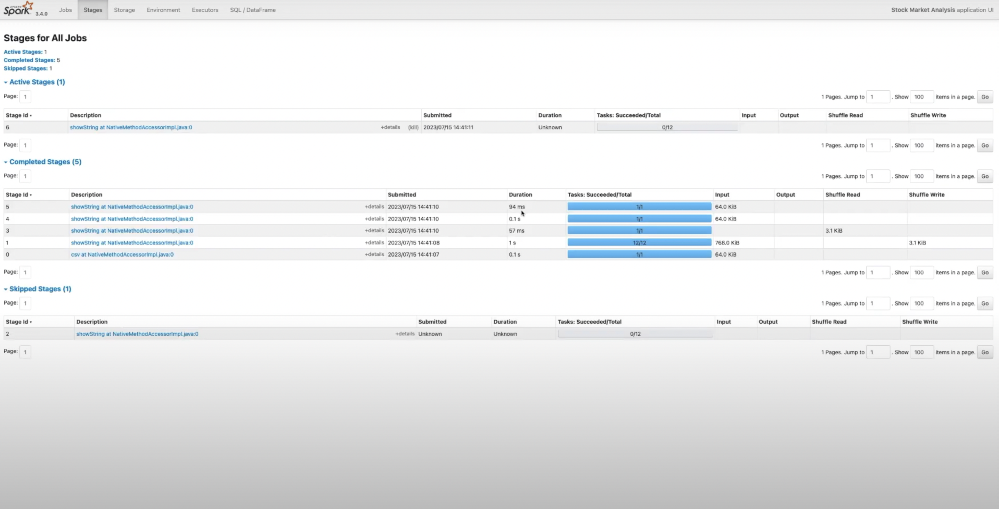

# Stock Data Analysis with Apache Spark



## Overview
This project leverages **Apache Spark** to perform large-scale analysis of stock market data. It demonstrates how to process, analyze, and visualize historical stock data using Spark's distributed computing capabilities. The project is ideal for those interested in big data analytics, financial data processing, and Spark programming.

## Features
- **Distributed Data Processing**: Utilizes Spark RDDs and DataFrames to handle large datasets efficiently.
- **Data Cleaning**: Implements Spark transformations to clean and preprocess stock data (e.g., handling missing values, filtering outliers).
- **Trend Analysis**: Computes moving averages, daily returns, and cumulative returns using Spark operations.
- **Visualization**: Integrates with Python libraries like Matplotlib and Seaborn for visualizing stock trends and performance metrics.
- **Scalability**: Designed to scale for analyzing massive stock datasets across distributed systems.

## Tools and Technologies
- Apache Spark (PySpark)
- Python
- Pandas (for lightweight analysis)
- Matplotlib and Seaborn (for visualization)
- yfinance or CSV datasets (for stock data)

## How to Use
1. Clone the repository:
   ```bash
   git clone https://github.com/i-tick/Stock-Data-Analysis.git
   ```
2. Install the required dependencies:
   ```bash
   pip install -r requirements.txt
   ```
3. Set up Apache Spark on your system and ensure PySpark is configured.
4. Run the Jupyter Notebook or Python scripts to perform stock data analysis:
   ```bash
   spark-submit stock_analysis.py
   ```

## Example Analysis
- **Data Loading**: Load stock data into Spark DataFrames.
- **Transformations**: Calculate moving averages, daily returns, and volatility using Spark SQL and DataFrame operations.
- **Visualization**: Plot stock trends and performance metrics using Matplotlib/Seaborn.

## Contribution
Contributions are welcome! Feel free to open issues or submit pull requests for improvements, additional features, or optimizations.

## License
This project is open-source and available under the [MIT License](LICENSE).